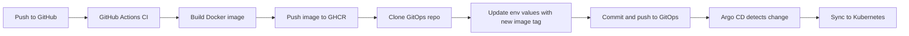

# CI/CD with GitHub Actions, GHCR, Helm & Argo CD (GitOps)

This repository documents a **working, reproducible GitOps pipeline** for Kubernetes apps using:

- **GitHub Actions** for CI/CD
- **GitHub Container Registry (GHCR)** for images
- **Helm** for templating/config
- **Argo CD** for continuous delivery (syncing the GitOps repo to your cluster)

It’s designed so that **app repos** build and publish images, then **commit only configuration changes** to a separate **GitOps repo**, which Argo CD watches and syncs automatically.

> This README is a reference for team members onboarding new services to the same pipeline model.

---

## ✨ What You Get

- Deterministic image tags (commit SHA)
- Minimal permissions (GHCR via `GITHUB_TOKEN`; GitOps repo via fine‑grained PAT)
- Automated Argo CD sync with prune & self-heal
- Clear branch → environment mapping (currently: `main → dev` for testing)

---

## 📦 Repositories & Structure

### App Repository (this one)
Holds:
- Application source code
- Dockerfile
- Workflow at `.github/workflows/ci.yml` that:
  1) Builds and pushes the image to GHCR  
  2) Clones the GitOps repo and updates the env values file  
  3) Commits/pushes the change

### GitOps Repository
Holds:
- Helm chart + app manifests under a chart path, e.g. `hello-world-service-app/`
- Environment value files under `environments/<env>/hello-world-service.yaml`
- Argo CD `Application` objects (could be centralized in a platform repo if preferred)

Recommended layout:
```
gitops/
├─ hello-world-service-app/           # Helm chart path Argo CD points to
│  ├─ Chart.yaml
│  ├─ templates/
│  └─ values.yaml
└─ environments/
   ├─ dev/
   │  └─ hello-world-service.yaml
   ├─ staging/
   │  └─ hello-world-service.yaml
   └─ production/
      └─ hello-world-service.yaml
```

---

## 🔁 Pipeline Flow



---

## 🧩 Argo CD Application Manifest (Example)

```yaml
apiVersion: argoproj.io/v1alpha1
kind: Application
metadata:
  name: hello-world-service-dev
  namespace: argocd
spec:
  project: default
  source:
    repoURL: https://github.com/VotingM7011E/gitops.git
    targetRevision: main
    path: hello-world-service-app
    helm:
      valueFiles:
        - ../environments/dev/hello-world-service.yaml
  destination:
    server: https://kubernetes.default.svc
    namespace: hello-world-service-dev
  syncPolicy:
    automated:
      prune: true
      selfHeal: true
    syncOptions:
      - CreateNamespace=true
```

The manifests fille currently can be applied with:
```bash
kubectl apply -f manifests/hello-world-service-dev.yaml
```
this creates the Argo CD application with the given sync policies. Argo CD continuously monitor the value files for new images. Deploys new images based on currently reported tag.

---

## 🧪 Dev Environment Values (Example)

```yaml
# Development Environment Configuration
app:
  name: hello-world-service
  replicas: 1

domain: helloworldservice-dev.example.com
email: you@example.com
environment: Development
message: "Hello from Development Environment!"

image:
  repository: ghcr.io/<org>/<repo-or-app>
  tag: <commit-sha>

ingress:
  certIssuer: letsencrypt-staging
```

---

## ⚙️ GitHub Actions Workflow (Full)

```yaml
name: Build, Push, and Update GitOps

on:
  push:
    branches: [ "main", "staging", "dev" ]
  workflow_dispatch:
    inputs:
      env:
        description: "Override target environment (dev|staging|production)"
        required: false
        default: ""

jobs:
  build:
    runs-on: ubuntu-latest

    # Permissions for *this* repo (code + GHCR). The push to GitOps repo uses the PAT secret.
    permissions:
      contents: read
      packages: write
      attestations: write
      id-token: write

    env:
      # --- App image ---
      IMAGE_REPO: ghcr.io/votingm7011e/hello-world-service

      # --- GitOps repo + paths ---
      GITOPS_REPO: votingm7011e/gitops
      GITOPS_BRANCH: main
      APP_FILE: hello-world-service.yaml     # The environment files in gitops repo

    steps:
      - name: Checkout code
        uses: actions/checkout@v4

      - name: Log in to GHCR
        run: echo "${{ secrets.GITHUB_TOKEN }}" | docker login ghcr.io -u ${{ github.actor }} --password-stdin

      - name: Build and Push Image
        id: build
        run: |
          IMAGE_TAG=${{ github.sha }}
          docker build -t "$IMAGE_REPO:$IMAGE_TAG" .
          docker push "$IMAGE_REPO:$IMAGE_TAG"
          echo "IMAGE_TAG=$IMAGE_TAG" >> "$GITHUB_OUTPUT"

      # Resolve environment: workflow input (if provided) > branch mapping
      - name: Resolve target environment
        id: resolve
        shell: bash
        run: |
          INPUT_ENV="${{ github.event.inputs.env }}"
          if [[ -n "$INPUT_ENV" ]]; then
            TARGET_ENV="$INPUT_ENV"
          else
            case "${GITHUB_REF_NAME}" in
              main)    TARGET_ENV="dev" ;;
              staging) TARGET_ENV="staging" ;;
              dev)     TARGET_ENV="dev" ;;
              *) echo "Unsupported branch '${GITHUB_REF_NAME}'. Provide env via workflow_dispatch input."; exit 1 ;;
            esac
          fi
          echo "TARGET_ENV=$TARGET_ENV" >> "$GITHUB_OUTPUT"
          echo "Will update environments/$TARGET_ENV/$APP_FILE"

      # --- Minimal & fast GitOps update (HTTPS + org secret PAT, sed-based) ---
      - name: Update GitOps repo with new image tag
        env:
          IMAGE_TAG: ${{ steps.build.outputs.IMAGE_TAG }}
        run: |
          set -euo pipefail

          # Clone GitOps repo using the org-level PAT secret (fine-grained: Contents RW)
          git clone --branch "$GITOPS_BRANCH" \
            "https://x-access-token:${{ secrets.GITOPS_TOKEN }}@github.com/${GITOPS_REPO}.git" gitops-repo

          cd gitops-repo
            
          VALUES_FILE="environments/${{ steps.resolve.outputs.TARGET_ENV }}/${APP_FILE}"
          if [[ ! -f "$VALUES_FILE" ]]; then
            echo "ERROR: $VALUES_FILE not found"; exit 1
          fi

          # Update .image.repository and .image.tag (simple sed; requires stable formatting)
          sed -i "s|^\(\s*repository:\s*\).*|\1${IMAGE_REPO}|" "$VALUES_FILE"
          sed -i "s|^\(\s*tag:\s*\).*|\1${IMAGE_TAG}|" "$VALUES_FILE"

          # Commit & push
          git config user.name  "GitOps CI"
          git config user.email "actions@github.com"
          git add "$VALUES_FILE"
          git commit -m "chore(${{ steps.resolve.outputs.TARGET_ENV }}): bump ${IMAGE_REPO} to ${IMAGE_TAG} [skip ci]" || echo "No changes to commit"
          git push origin "$GITOPS_BRANCH"
```

---

## 🚀 How to Add a New App

1. Create app repo with Dockerfile + workflow.
2. Set `IMAGE_REPO` to your GHCR path.
3. Prepare GitOps repo with Helm chart + env files.
4. Add Argo CD Application pointing to chart + env file.
5. Configure secrets (`GITOPS_TOKEN`).
6. Push to branch or trigger manually.
7. Verify Argo CD sync.

---

## ✅ Next Steps

- Add production env values.
- Switch `main → production` mapping.
- Integrate Cosign + SBOM.
- Consider Argo Rollouts for progressive delivery.

---

**Author:** Jacob Sjöström
**Purpose:** Reference for deploying apps using GitOps-based CI/CD pipeline.
